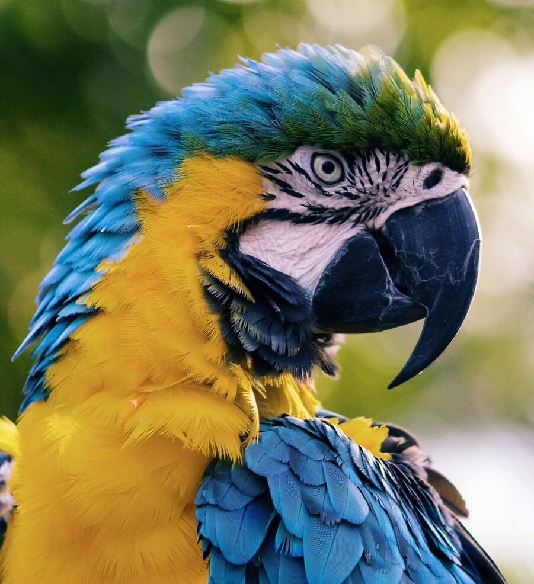
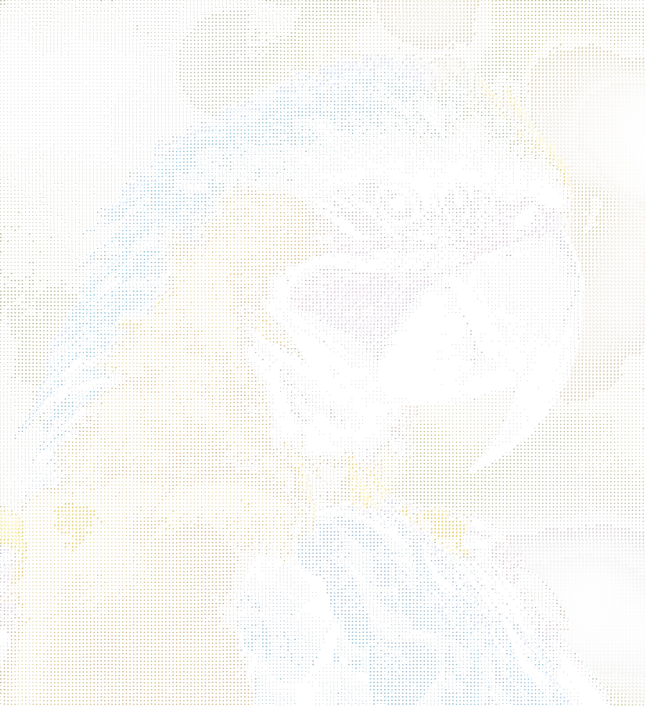
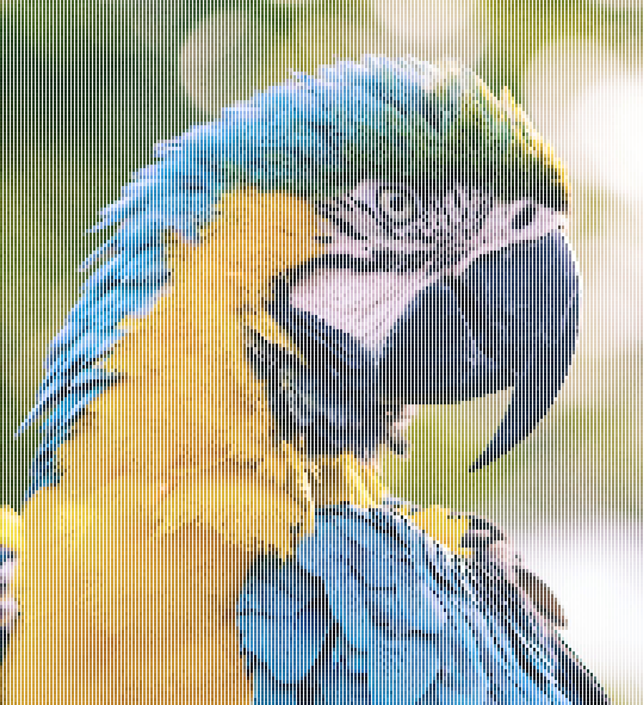
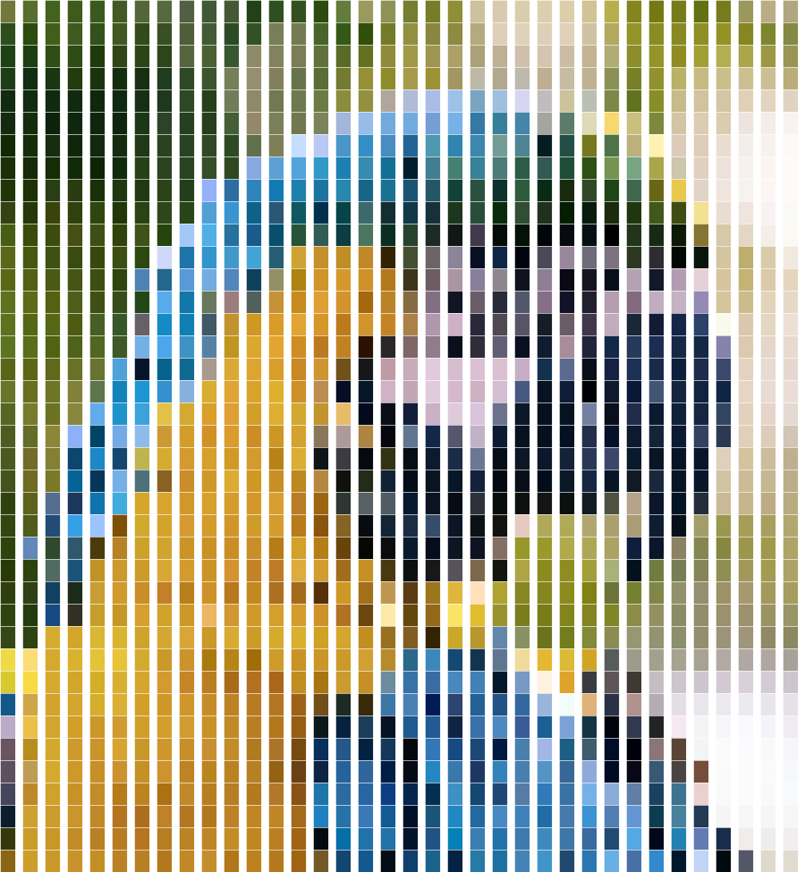

A CLI tool for converting images to ASCII

# Usage
```bash
git clone https://github.com/Letharrick/rusciify.git
cd rusciify
cargo run --release -- --help
```

# Examples


[Photo source](https://unsplash.com/photos/lylCw4zcA7I)
<br/>

### Basic
```
rusciify example.jpg -o ascii
```


### Custom character map
```
rusciify example.jpg -o ascii_nums -c 0123456789
```


### Solid character map
```
rusciify example.jpg -o ascii_solid -s
```


### Custom character scale
```
rusciify example.jpg -o ascii_solid_scaled -s -a 25
```
